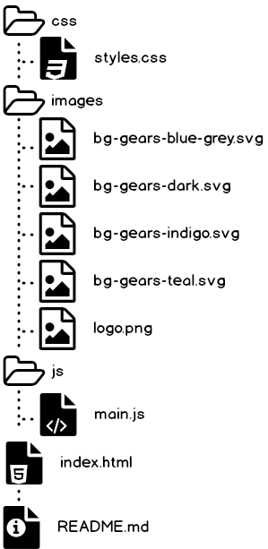

# Dynamic web Themes Example
This is a single page website that demonstrates how to use dynamic themes within a website using local storage.
This gives your user the control to switch themes by a click of a button

## Contents
1. [File Structure](#)
2. [Methodology](#)
3. [Themes](#)
4. [License](#)
5. [Contributing](#)
6. [Bugs]()
7.  [Miscellaneous](#)

## Methodology
In order to be able to switch themes dynamically,  you need to figure out the following
- multiple styles for the same elements
- ensure one theme doesn't override another
- saving user preferences
- default theme

This project focuses on changing the following
1. colors
2. background-colors
3. background-images

for each theme, we dynamically **add a class** to the `body` element, every time the user selects a theme we remove any existing theme class and add the one that the user selected. Very minimal coloring is used without any theme selected, this makes it easy to add colors to elements without the use of css override `!important`.

Local storage is used to store the user preferences with the key `theme`, the value is the class name of the theme.

The helper method `fetchTheme`  checks the local storage for a user selected theme, if none it defaults to _theme-teal_, let the code do the talking, here is a snippet.
```javascript
let theme = localStorage.getItem("theme");
    // return the default theme if none is defined;
    return !theme ? "theme-teal" : theme;
```
## File Structure

_made with Balsamiq Mockups 3_
## Themes
To switch themes click the buttons with the the `@` symbol, you are presented with a drop down to choose any theme you like.

Currently this are the available themes
1. Teal
2. Blue-grey
3. Indigo
4. Dark

By default we are using `teal` theme when no theme is specified

### adding a theme
in the `styles.css` file add  theme with the following code, this is the code for the teal theme
```css

/* THEME TEAL */
.theme-teal{
    background: url("../images/bg-gears-teal.svg") #f1f1f1 fixed;
    -webkit-tap-highlight-color: #009688;
}

.theme-teal nav,
.theme-teal nav .search,
.theme-teal header.hero,
.theme-teal footer{
    background-color: #009688;
}

.theme-teal .btn{
    outline-color: #009688;
}

.theme-teal footer .copyright,
.theme-teal li.active a{
    background-color: #00796b;
    color: #fff;
}

.theme-teal .btn{
    background-color: #ff5252;
    color: #fff;
}
.theme-teal footer ul li a:hover,
.theme-teal footer .copyright a:hover{
    color: #ff5252;
}

.theme-teal .btn:hover{
    background-color: #ff1744;
}
.theme-teal .drop-down li a:hover{
    color: #ff1744;
}

```
customize the colors add html for it in the dropdown, the html for theme teal is like the following
```html
<li><a class="themer" data-theme="teal" href="#">Teal</a></li>
```
where `data-theme` attribute is the identifier for your theme.
Finally `themeChanger` function in the `main.js` file and **add the case** for your theme in the `switch statement`. the case for theme teal looks like this
```javascript
 case "teal":
            removeAddClassToBody("theme-teal");
            console.log("switched to theme-teal");
            break;
```
> Note that the case should match the `data-theme` attribute in the html

Lastly, in the function `removeAddClassToBody` add the class name of your them to the array of theme
```javascript
let themes = ["theme-teal", "theme-indigo", "theme-dark", "theme-bg"];
```
#### persisting user preferences
we use local storage to store and retrieve user choices and default the default theme when no preferences have been selected by the user.
## License
MIT
## Contributing
all are welcomed :laughing:
## Bugs
1. no default theme specified for non-JavaScript agents
2. i can't get this READ ME contents to navigate to sections(markdown) :pray: 
## Miscellaneous
- Am new at this
- open for corrections
- i love JS/Node